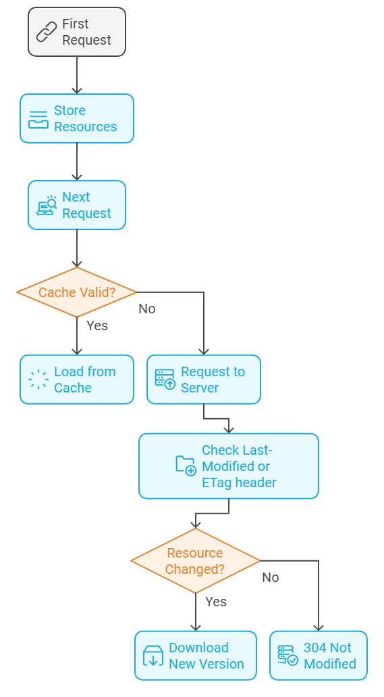
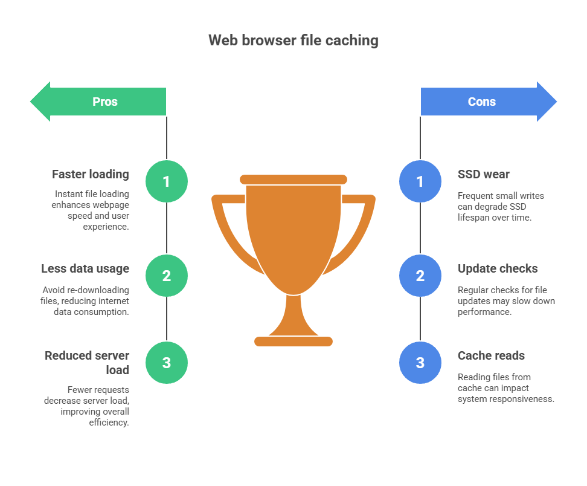
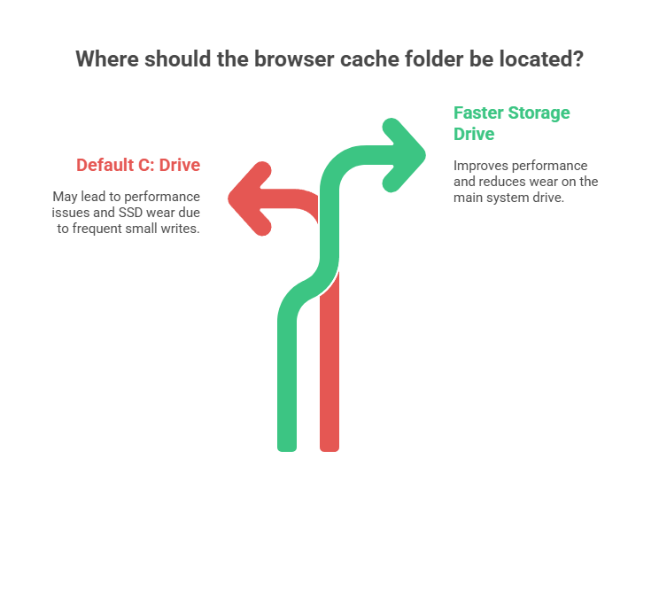

# Web Browser Cache Folder Manager - User Guide

_Web Browser Cache Folder Manager_ is a Windows utility application that helps you optimize your web browsing experience by managing where your browser stores its cached files. With this tool, you can move your browser's cache folder to a faster storage drive, which can improve your browsing performance and reduce wear on your main system drive.

## What is a Web Browser Cache Folder?

When you browse the internet, your web browser saves copies of files (like images, scripts, and web pages) from websites you visit into a special storage area called the cache folder. This is like having a local copy of website content on your computer. The next time you visit the same website, your browser can quickly load these files from your computer instead of downloading them again from the internet web server.

Here is how the web browser cache works.

* **First Request:** The first time a user visits a web page, the browser downloads all the necessary resources from the web server. At the same time, the web server provides information about how the browser will cache resources, including Cache-Control headers, Expires headers, ETag, Last-Modified headers, and so on in its responses.
* **Store Resources:** Downloaded resources are stored in the browser's cache directory. The type and duration of storage of resources is determined by header information sent from the web server.
* **Next Request:** When a user revisits the same web page, the browser first checks to see if any resources are stored in the cache.
  * **Cache Hit Case:** If the resources stored in the cache are valid (unexpired), the browser quickly loads web pages using the cached resources without requesting the server.
  * **Cache Miss Case:** If no or expired resources are stored in the cache, the browser requests the web server again to download the resources and stores the new resources in the cache.
    * The server then uses the Last-Modified or ETag header to verify that the resources have been changed and, if not, returns a 304 Not Modified status code to prevent unnecessary data transfer.

This caching system provides several benefits:

* *Faster webpage loading* - files load instantly from your computer
* *Less internet data usage* - no need to re-download the same files
* *Reduced load on web servers* - fewer requests to download files

However, working with cached files involves several operations that can impact your system's performance:

* *Writing new files to the cache folder*
  * These are typically small, frequent writes that can wear out SSDs over time
* *Checking if cached files are up-to-date*
* *Reading files from the cache folder*

So, the goal is to maximize the pros and minimize the cons.

You can find more information about browser cache folder at the following sites.

* [Moving Chrome cache folder?](https://superuser.com/questions/866016/moving-chrome-cache-folder/1863614#1863614)
* [How to Change the Google Chrome Cache Location](https://www.simplehelp.net/2010/11/16/how-to-change-the-google-chrome-cache-location/)
* [How to Change Google Chrome Cache Location in Windows](https://www.windowsdigitals.com/how-to-change-google-chrome-cache-location-in-windows-11-10/)
* [How to Change the Google Chrome Cache Location](https://www.shareus.com/web/how-to-change-the-google-chrome-cache-location.html)

## Where to locate Web Browser's Cache Folder?

To maximize performance and minimize wear on your main system drive (typically the C: SSD drive), it's recommended to move your browser's cache folder to a faster storage drive. By default, browsers store their cache on the same drive where Windows is installed (usually the C: drive), but this isn't always the optimal location for storing web cache files.

As an alternative, we can create a RAM drive and locate the cache folder on the RAM drive.

## Why should you change web browser's cache folder to the RAM Drive?

By redirecting the cache folder to a RAM disk drive,

* You can store web cache files faster than using the NVMe SSD, which reduces write workload into the SSD.
* You can read web cache files faster that using the NVMe SSD, which reduces cache files loading overhead.

For more details, refer [here](https://github.com/kmscom/Browser-Cache-Folder-Changer/wiki).

## Then, what is the *Web Browser Cache Folder Manager* for?

Even though using the RAM Disk for storing web cachf files can have several benefits, changing the browser's cache folder location is not easy. *Web Browser Cache Folder Manager* helps the user changing browser's cache folder with some mouse clicks. For more details, refer TBD.

## Which RAM Disk Drive applications are available?

You may use famous RAM Disk applications such as

* [AIM Toolkit download | SourceForge.net](https://sourceforge.net/projects/aim-toolkit/)
  * This application provides user-friendly GUI interface and cache file backup and restore functions. If you need to store the files in the RAM Disk, then use this application.
* [ImDisk Toolkit - Free RAMDisk &amp; Image File Mounting](https://imdisktoolkit.com/)
* [OSFMount - Mount Disk Images &amp; Create RAM Drives](https://www.osforensics.com/tools/mount-disk-images.html)

## Which web browsers are supported by the *Web Browser Cache Folder Manager*?

*Web Browser Cache Folder Manager* supports Chrome-based web browsers such as

* [Brave](https://brave.com/)
* [Comet](https://www.perplexity.ai/comet/)
* [Google Chrome](https://www.google.com/)
* [Microsoft Edge](https://www.microsoft.com/edge/)
* [Naver Whale](https://whale.naver.com/)
* [Epic Browser](https://epicbrowser.com/)
* [Opera](https://www.opera.com/)
* [Vivaldi](https://vivaldi.com/)
* [Yandex Browser](https://browser.yandex.com/)

and Firefox-based web browsers such as

* [Firefox](https://www.firefox.com/)
* [SlimBrowser](https://www.slimbrowser.net/)
* [Waterfox](https://www.firefox.com/)

## Acknowledgement

The figures in this page are created by [Napkin.ai](https://www.napkin.ai/).
